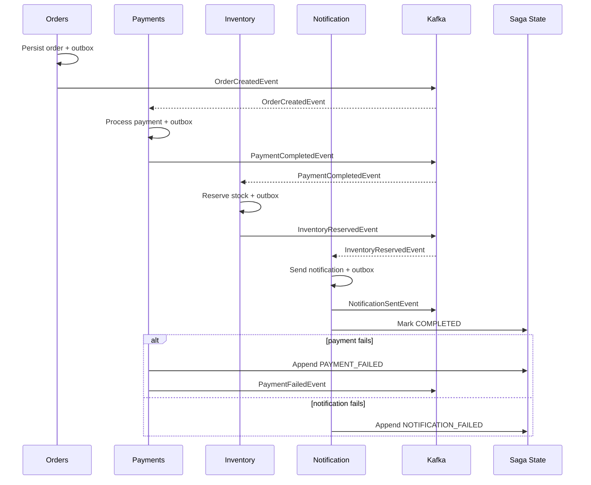

# Order Fulfillment Saga

## Overview

The order fulfillment saga captures the end-to-end choreography across the Order, Payment, Inventory, and Notification services. Each step writes a domain aggregate and appends an outbox record while updating a shared saga state stored in the `common-sagas` module.

## Participants & Steps

| Step | Service | Event / Action | Saga Marker |
|------|---------|----------------|-------------|
| 1 | `orders-service` | Persist `OrderEntity` and emit `OrderCreatedEvent` | `ORDER_CREATED` |
| 2 | `payments-service` | Consume `OrderCreatedEvent`, charge payment, emit `PaymentCompletedEvent` | `PAYMENT_COMPLETED` |
| 3 | `inventory-service` | Consume `PaymentCompletedEvent`, reserve inventory, emit `InventoryReservedEvent` | `INVENTORY_RESERVED` |
| 4a | `notification-service` | Consume `InventoryReservedEvent`, send confirmation, emit `NotificationSentEvent` | `NOTIFICATION_SENT` (saga completes) |
| 4b.i | `inventory-service` | Compensation: release reserved inventory when upstream failure occurs | `INVENTORY_RELEASED` |
| 4b.ii | `payments-service` | Compensation: mark payment refund and fail saga | `PAYMENT_COMPENSATED` |
| 4b.iii | `notification-service` | On dispatch failure, mark notification failed; saga transitions to `FAILED` with `NOTIFICATION_FAILED:<reason>` | `NOTIFICATION_FAILED` |

## Saga Persistence

- Module: `common-sagas`
- Entity: `SagaStateEntity` (`sagas` table with optimistic locking)
- Service: `SagaStateService` orchestrates `start`, `transition`, `complete`, and `fail` operations.
- `SagaStepFormatter` captures step history (`<step>@<timestamp>`), enabling observability and replay tooling.
- Flyway migration: `common-sagas/src/main/resources/db/migration/V1.1__create_sagas_table.sql`

## Service Integration

- `orders-service`: starts the saga on successful order creation.
- `payments-service`: transitions the saga to `IN_PROGRESS` after payment completion and records the step name.
- `inventory-service`: appends `inventory-reserved` step; saga remains `IN_PROGRESS` awaiting notification.
- `notification-service`: either completes the saga after successful dispatch or marks it `FAILED` when retries exhaust while capturing the failure reason.

## Sequence Diagram

## Metrics & Observability

- `SagaMetricsRecorder` records a Micrometer counter named `saga.step.processed` with tags `sagaType`, `step`, and `state`.
- Each service increments the counter when it appends its saga marker (including compensations). Shared tests assert counter deltas to prevent double-counting.
- Phase 5 will add Grafana dashboards plotting per-step throughput, failure counts, and compensation rate; alerts will watch for sudden spikes in `FAILED` states.

## Testing

- Unit and integration tests per service assert saga transitions and metrics:
  - `OrderServiceTest` ensures saga begins in `STARTED` state.
  - `PaymentServiceTest` and `PaymentOrderListenerTest` verify the payment step is appended and counters increment.
  - `InventoryServiceTest` and `InventoryReservationListenerTest` assert inventory transitions, compensation markers, and metrics.
  - `NotificationServiceTest` and `NotificationListenerTest` cover completion, failure scenarios, and failure counter growth.

## Next Enhancements

- Add Temporal orchestration for long-running variants while retaining choreography for the happy path.
- Build Grafana dashboards (Phase 5) using `saga.step.processed` metrics with alerting on compensation spikes.
- Extend schema contract tests to replay compensation events through downstream handlers.
